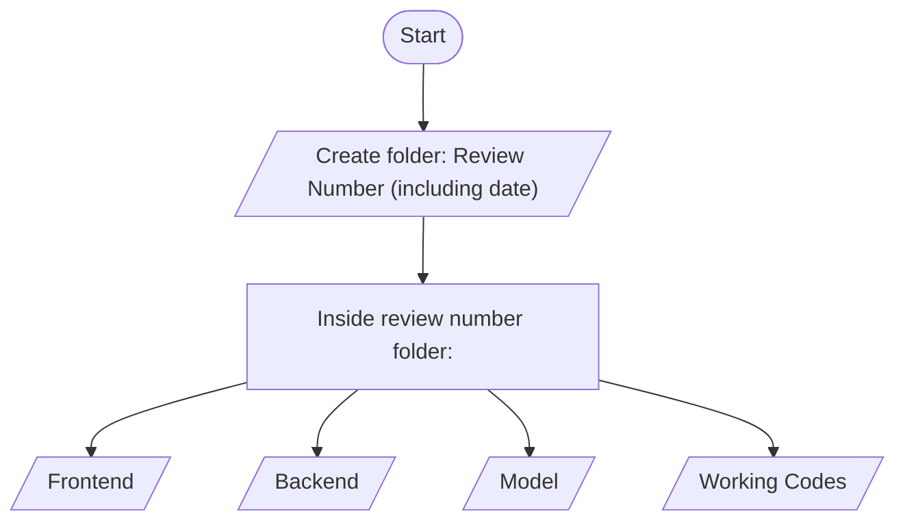

# FlowTron
An assistant that helps you organize, summarize and and analyze daily tasks

# Contribution Workflow and Project Structure

## Contribution Flowchart




## Folder Structure Example

```
review-31-07-25/
│
├── frontend/
│   └── [Frontend-related files]
├── backend/
│   └── [Backend-related files]
├── model/
│   └── [Model-related files]
└── Final/
    └── [All complete working code files/scripts] (this folder is to have the entire working version of the code
```


- **review-31-07-25**: Main folder named after the review number and date.
    - **frontend**: Contains all frontend implementation files.
    - **backend**: Contains backend implementation files.
    - **model**: Contains files related to ML/data models.
    - **Final**: All finalized working code provided for the review.

---

**Instructions:**
- Each new contribution starts by creating a folder with the review number and date.
- For each contribution, separate files by purpose (frontend, backend, model).
- Place all working, tested codes in the `Final/` folder inside the corresponding review directory.

---
